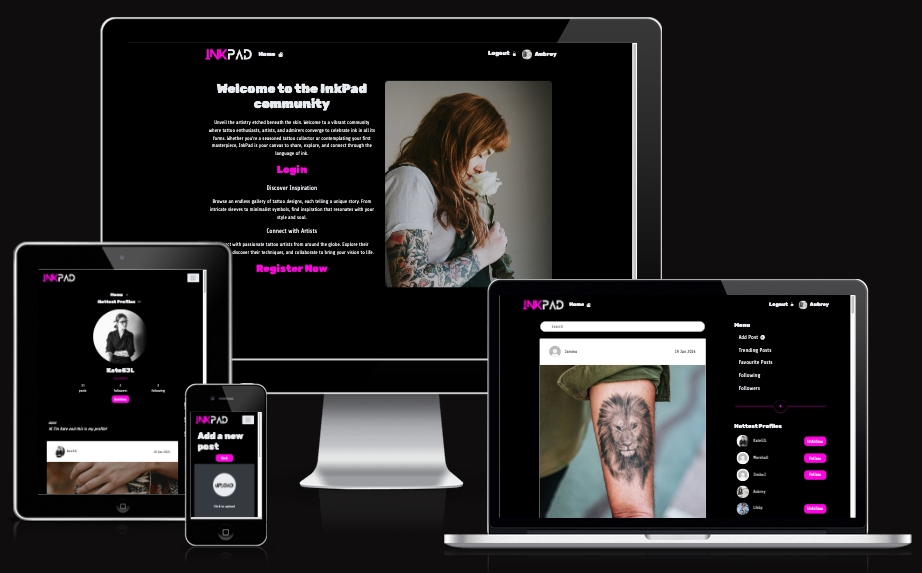

# InkPad

InkPad is social media platform designed to share, explore and connect with a community of users. The core aim of this web application is to promote and share tattoo designs, and to connect tattoo enthusiasts, artists, and admirers alike.

Users will be able to browse and search through posts. They will be able to create their own posts, and attach tags to these to help others to find certain categories more easily. They will also be able to comment on eachothers posts, and to follow/be followed by other users.

[Visit the live website here](https://pp5-kl-c6a010106309.herokuapp.com/)

 

## Contents

---

### [User Experience (UX)](#user-experience-ux-1)

- [Purpose](#purpose)
- [User Stories](#user-stories)
  - [First Time Visitors](#first-time-visitor-goals)
  - [Returning Visitors](#returning-visitor-goals)
  - [Frequent Users](#frequent-visitor-goals)

### [Design](#design-1)

- [Colour Scheme](#colour-scheme)
- [Typography](#typography)
- [Imagery](#imagery)
- [Wireframes](#wireframes)

### [Features](#features-1)

- [Existing Features](#existing-features)
  - [Homepage](#homepage)
  - [Next page](#next_page)
- [Accessibility](#accessibility)
- [Future Features](#future-features)

### [Technologies](#technologies-1)

### [Version Control](#version-control-1)

### [Deployment](#deployment-1)

### [Testing](#testing-1)

- [Function Testing](#function-testing)
- [User Story Testing](#user-story-testing)
- [Lighthouse](#lighthouse)
- [Validator Testing](#validator-testing)
- [Bugs](#bugs)

### [Credits](#credits-1)

- [Resources](#resources)
- [Acknowledgements](#acknowledgements)

 

---

 

## User Experience (UX)

### **Purpose**

Enter purpose description

 

### User Stories

### **Client Goals**

-

 

### **First Time Visitor Goals**

-

 

### **Returning Visitor Goals**

-

 

### **Frequent Visitor Goals**

-

 

---

## Design

### **Colour Scheme**

 

### **Typography**

 

### **Imagery**

 

### **Wireframes**

[Balsamiq Wireframing Software](https://balsamiq.com/) was used to create the wireframes.

Homepage (mobile)

Homepage (desktop)

 

Next Page (mobile)

Next Page (desktop)

 

For a full PDF of all wireframes (mobile, tablet, desktop) click [here]().

---

## Features

### **Existing Features**

 

### **Accessibility**

In addition to being best practice, having an accessible website is extremely high on the list of requirements for the target audience. Close attention has been paid to the following in order to ensure the site is as accessible as possible:

- Clear and simple font styling, avoiding any cursive or calligraphic scripts.
- Contrasting colour scheme, but avoiding colours that are too bold.
- Use of semantic HTML
- Ensuring all images have an alt description for screen readers or where the image cannot be loaded. Also ensuring that these are as descriptive as possible.

 

### **Future Features**

In the future there are features and developments that it would be useful to consider adding to create an even better user experience of this website. They include:

-

 

---

## Technologies

### **Languages Used**

This website has been written in .

 

**Frameworks, Libraries and Programs Used**

-

 

---

## Version Control

Version control has been maintained using Git. The code written for this website has been updated via regular commits to Github. These serve as a record of development and changes made.

The commit history can be viewed [here]()

 

---

## Deployment

 

---

## Testing

Testing was performed across a range of devices, including:

-

### **Function Testing**

| Page | Test | Successfully Completed |
| :--- | :--- | :--------------------: |
|      |      |                        |
|      |      |                        |
|      |      |                        |
|      |      |                        |
|      |      |                        |
|      |      |                        |
|      |      |                        |

 

### **User Story Testing**

| Client Goal | Solution | Tested & Successfully Completed |
| :---------- | :------- | :-----------------------------: |
|             |          |                                 |
|             |          |                                 |
|             |          |                                 |
|             |          |                                 |
|             |          |                                 |

 

| First Time Visitor Goal | Solution | Tested & Successfully Completed |
| :---------------------- | :------- | :-----------------------------: |
|                         |          |                                 |
|                         |          |                                 |
|                         |          |                                 |
|                         |          |                                 |

 

| Returning Visitor Goal | Solution | Tested & Successfully Completed |
| :--------------------- | :------- | :-----------------------------: |
|                        |          |                                 |
|                        |          |                                 |
|                        |          |                                 |

 

| Frequent Visitor Goal | Solution | Tested & Successfully Completed |
| :-------------------- | :------- | :-----------------------------: |
|                       |          |                                 |
|                       |          |                                 |
|                       |          |                                 |

 

### **Lighthouse**

For Mobile Devices

Homepage

Dates Page

 

For Desktop

Homepage

Dates Page

 

### **Validator Testing**

HTML

Homepage

Dates Page

 

CSS

Stylesheet

   

### **Bugs**

| Raised by | Bug | Solution |
| :-------- | :-- | :------- |
|           |     |          |
|           |     |          |
|           |     |          |
|           |     |          |
|           |     |          |
|           |     |          |

 

---

## Credits

### **Resources**

-

 

### **Acknowledgements**
