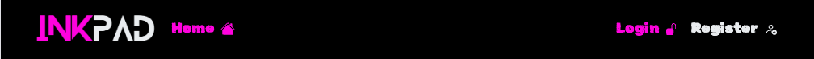
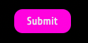

# InkPad

InkPad is social media platform designed to share, explore and connect with a community of users. The core aim of this web application is to promote and share tattoo designs, and to connect tattoo enthusiasts, artists, and admirers alike.

Users will be able to browse and search through posts. They will be able to create their own posts, and attach tags to these to help others to find certain categories more easily. They will also be able to comment on eachothers posts, and to follow/be followed by other users.


[Visit the live website here](https://pp5-kl-c6a010106309.herokuapp.com/)

### Back-End API

This project has been built as part of the Advanced Front-End module of my EQF Level 5 Diploma in Full Stack Software Development.
The back-end API for this site was created using Django REST Framework:

[Visit the InkPad API repository here](https://github.com/llewellynksj/pp5-api)

[Visit the InkPad Live API here](https://pp5-api-kl-a5aee8435a6f.herokuapp.com/)

<br>

## Contents

---

### [User Experience (UX)](#user-experience-ux-1)

- [Purpose](#purpose)
- [User Stories](#user-stories)

### [Design](#design-1)

- [Colour Scheme](#colour-scheme)
- [Typography](#typography)
- [Imagery](#imagery)
- [Wireframes](#wireframes)

### [Project Logic](#project-logic-1)

- [User Journey](#user-journey)
- [Kanban Board](#kanban-board)

### [Project Structure](#project-structure-1)

- [Components](#components)
  - [NavBar](#navbar)
  - [Footer](#footer)
  - [AddEmoji](#addemoji)
  - [Hottest Profiles, SideBar and DividerLine](#hottest-profiles-sidebar-and-dividerline)
  - [BackToTopButton](#backtotopbutton)
  - [Button](#button)
  - [DividerLine](#dividerline)
  - [MenuDropDown](#menudropdown)
  - [Asset](#asset)
  - [Avatar](#avatar)
  - [ImageCropper](#imagecropper)
  - [HottestProfiles](#hottestprofiles)
  - [Profile](#profile)
  - [Post](#post)

### [Features](#features-1)

- [Existing Features](#existing-features)
  - [Home](#home)
  - [Login and Register](#login-and-register)
  - [Add Post](#add-post)
  - [Add Comment Form](#add-comment-form)
  - [Following and Followers](#following-and-followers)
- [Accessibility](#accessibility)
- [Future Features](#future-features)

### [Technologies](#technologies-1)

### [Version Control](#version-control-1)

### [Deployment](#deployment-1)

### [Testing](#testing-1)

### [Credits](#credits-1)

- [Resources](#resources)
- [Acknowledgements](#acknowledgements)

<br>

---

<br>

## User Experience (UX)

### **Purpose**

InkPad aims to provide a welcoming and open social media platform for users from all backgrounds to connect and share content.
It strives to provide a community to all users with no discrimination of their personal views and values.

<br>

### User Stories

| User Story                                                                                     | Epic      |
| :--------------------------------------------------------------------------------------------- | :-------- |
| As a user I can navigate the website easily so I can find the pages I want                     | Feature   |
| As a user I can create a profile so I can interact in the community of registered users        | Profiles  |
| As a registered user I can login to view my own profile                                        | Profiles  |
| As a user I can edit my profile and profile image so I can keep my profile updated             | Profiles  |
| As a user I can post images to share my designs with the community                             | Posts     |
| As a user I can view other posts by registered users so I can look for inspiration             | Posts     |
| As a user I can favourite other users posts so I can easily refer back to them                 | Posts     |
| As a user I can follow other users so that I can easily find their new posts                   | Followers |
| As a user I can see which followers are following me so that I can reciprocate following       | Following |
| As a user I can filter posts by their tags so I can look for specific types of images          | Posts     |
| As a user I can filter posts by their user so I can see all the posts by one specific user     | Profiles  |
| As a user I can search posts with keywords so I can look for specific types of images          | Posts     |
| As a user I can see the most like images so I can keep up to date with what’s trending         | Posts     |
| As a user I can scroll the posts feed so that I don’t have to click a next button              | Posts     |
| As a user I can post comments on other users posts so I can share my thoughts                  | Comments  |
| As a user I can view other users comments on my posts and other users posts                    | Comments  |
| As a user I can edit my own posts so I can correct any errors                                  | Posts     |
| As a user I can delete my own posts so I can remove any unwanted posts                         | Posts     |
| As a user I can edit my own comments so I can correct any errors                               | Comments  |
| As a user I can delete my own comments so I can remove any no longer wanted comments I’ve made | Comments  |
| As a user I can view other users’ profiles so I can see their full posts and follow them       | Profiles  |
| As a user I can see the most followed profiles so I can see who is trending                    | Profiles  |

<br>

---

## Design

### **Colour Scheme**

The design of the site was based on an alternative and punky vibe. The site was designed with a dark theme with a black background throughout, utilising a variation of white (#E9ECEF) as the primary font colour. The contrasting bright pink (#FF00DE) was used as a secondary highlighting colour, to make certain things pop.

<br>


<br>

### **Typography**

The [Google Fonts]() 'Rubik Distressed' was used for headings. This font is in keeping with the aesthetics of the site.


<br>

For the main content font, 'Moulpali' was used. This is a very simple and easy to read font that was picked with accessibility being the forefront concern. The slightly squared shape of the letters felt more in keeping with the overall design than a more curved, softer, font.


<br>

### **Imagery**

The InkPad logo was created using [Canva](https://www.canva.com/). The font used in the logo is 'Blanka', and again was chosen due to it's bold, punky style. This font has also been used to create the 'Upload' and 'No results found' images.


<br>

### **Wireframes**

[Balsamiq Wireframing Software](https://balsamiq.com/) was used to create the wireframes.

<details>
<summary>Home Page</summary>


</details>
<details>
<summary>NavBar</summary>


</details>
<details>
<summary>Profile Page</summary>


</details>
<details>
<summary>Post List</summary>


</details>
<details>
<summary>Post Page</summary>


</details>
<details>
<summary>Add Post</summary>


</details>
<br>

---

## Database and Logic

### **User Journey**


<br>

### **Kanban Board**

A Kanban approach was used to keep track of the flow of the project. Once User Stories were set up in the Project they were assigned to EPICs and began the project journey in the 'ToDo' column. As development progressed these moved through 'In Progress' to finally 'Done'. An additional column was added 'Unable to implement' for any features that were not successfully completed.

[You can visit the project board here](https://github.com/users/llewellynksj/projects/11)

Below is an example part way through the site build:


---

## Project Structure

### **Components:**

### NavBar

The NavBar was created to show different icons/links based on whether the current user is logged in or not:

Non-logged in user:


Logged-in user:


### Footer

The Footer has been kept very simple, showing just the logo, website designer name, and relevant social links:


### AddEmoji

The AddEmoji component was created using the [Emoji Picker React](https://www.npmjs.com/package/emoji-picker-react) library.
Initially the emoji picker was just added to the AddPostForm, but in realising it would also be used on the AddCommentForm and EditCommentForm, the fucntion was refactored into it's own reusable component.

For further details, see the [Add Comment Form](#add-comment-form) within [Existing Features](#existing-features)

### Hottest Profiles, SideBar and DividerLine

The sidebar was designed to hold a basic menu of quicklinks. From here the user can easily open the following pages:

- The page to upload a new post
- Trending posts (posts ordered in decsending order of most likes)
- Favourite posts (posts that the current user has liked)
- Following (posts from users that the current user is following)
- Followers (posts from users that are following the current user)

A DividerLine component was created to show seperation between the sidebar menu and the hottest profiles list. The hottest profiles list shows the most popular profiles.


### BackToTopButton

As inifinite scroll was implemented on the page showing all posts, a back to the top button component was also designed. This button shows on pages where a large number of posts are/could be rendered.

A simple click of the bright pink arrow button sends the user back to the top of the page:

[](https://gyazo.com/5df28bf214cfdbe999429e2b99d25402)

### Button

A resuable button component was created to ensure the buttons had continuity of design throughout



### MenuDropDown

The MenuDropDown component is used across the site when a small drop down menu is required. For exmaple options to edit the profile page, or options to edit/delete comments on a post.


### Asset

The Asset component has multi-functionality. It is primarily used to show a loading spinner.

### Avatar

The avatar component is used on pages where the profile image is presented. It is a rounded version of this image:


### Profile

The Profile page is a central component used to display details of the current user:


### Post

The Post component renders the post that has been uploaded by the user. It is passed to other components such as the PostList to render all posts by users.


---

## Features

### **Existing Features:**

### Home

The Home page has been created as an initial introduction to InkPad. It features some content explaining what the site is about, links to login and register, and a carousel of images.

The images on the carousel have been purposefully selected to show that InkPad is resprentative of all people, and all styles to strengthen it's messgae of inclusivity.
Images have been sourced from [Pexels](https://www.pexels.com/) and [Unsplash](https://unsplash.com/).

[](https://gyazo.com/c7327476e92c115cee9cb96ea4da7042)

### Login and Register

Register Page:


Login Page:


### Add Post

The Add Post Form allows users to upload an image, add a caption, and apply up to 5 different tags. The tags are used to assist with keyword searching.


A simple image cropper has been implemented on the add post form. This is so that images are consistent in size when a user posts. However, there are some minor issues with this. Given more time, and for future implementations, this would be improved. Currently the cropper can be bypassed by the user and an image can be uploaded without being resized.


An emoji picker has also been added to the Add Post Form, as outlined in the Add Comment Form below.

### Add Comment Form

The Add Comment form appears below the post of the individual post page:


<br>

An **emoji picker** has been integrated into the add/edit comment form (as well as the add post form).


### Following and Followers

In order for the user to know which other users are following them, or to quickly see the posts of users they follow, quicklinks have been created in the sidebar menu to redirect to a version of the PostList that renders posts of followers/following.

<br>

## **Accessibility**

The style of the website has utlised a rough punky style. However, in keeping with best practices steps have still been taken to ensure accessibility is considered throughout.

Close attention has been paid to the following in order to ensure the site is as accessible as possible:

- Contrasting colour scheme.
- Use of semantic HTML.
- Ensuring all images have an alt description for screen readers or where the image cannot be loaded. Also ensuring that these are as descriptive as possible.

<br>

## **Future Features**

In the future there are features and developments that it would be useful to consider adding to create an even better user experience of this website. They include:

- Advanced implementation of the image cropper including on the profile avatar
- A more advanced filtering system where users can select a dropdown filter and sort posts by user, tag, date etc
- A more in-depth Profile page that offers artisits a tool for building a portfolio of work
- A messaging service that allows users to connect with private chats
- Incorporate the search bar within the NavBar and so have it appear across all pages
- Advanced implementation of the emoji picker so it is integrated with any textareas more seamlessly

<br>

---

## Technologies

### **Languages Used**

- HTML
- CSS
- JavaScript ES6
- JSX (an extension to JavaScript ES6)

<br>

**Frameworks, Libraries and Programs Used**

- [React](https://react.dev/)

- [Bootstrap](https://getbootstrap.com/) - styling
- [React Bootstrap](https://react-bootstrap.netlify.app/) - styling
- [Material UI](https://mui.com/material-ui/) - specifically used for building the ImageCropper
- [ElephantSQL](https://www.elephantsql.com/) - database
- [Font Awesome](https://fontawesome.com/) - icons
- [React Icons](https://react-icons.github.io/react-icons/) - icons
- [Balsamiq](https://balsamiq.com/) - wireframes
- [Cloudinary](https://cloudinary.com/) - image storage
- [Google Fonts](https://fonts.google.com/) - fonts
- [Heroku](https://dashboard.heroku.com/apps) - deployment
- [Am I Responsive](https://ui.dev/amiresponsive) - checking responsive across different screen sizes
- [Birme](https://www.birme.net) - image resizing
- [Remove BG](https://www.remove.bg/) - remove image backgrounds
- [Canva](https://www.canva.com/) - designing the logo
- [Coolors](https://coolors.co/) - designing colour palette
- [React Easy Crop](https://www.npmjs.com/package/react-easy-crop) - image cropping
- [Emoji Picker React](https://www.npmjs.com/package/emoji-picker-react) - emoji picker
- [React Rouer Dom](https://www.npmjs.com/package/react-router-dom)
- [Axios](https://www.npmjs.com/package/axios) - HTTP client for the browser and node.js
- [React Infinite Scroll](https://www.npmjs.com/package/react-infinite-scroll-component)
- [Gyazo](https://gyazo.com) - creating GIFs for README
- [Miro](https://miro.com/app/dashboard/) - creating database diagrams

<br>

---

## Version Control

Version control has been maintained using Git. The code written for this website has been updated via regular commits to Github. These serve as a record of development and changes made.

The commit history can be viewed [here](https://github.com/llewellynksj/pp5-kl/commits/main/)

<br>

---

## Deployment

### Deploy to Heroku

1. Create a new repository on GitHub
2. Open the repository in your chosen IDE
3. In the terminal, create a React app using the following command:

```
npx create-react-app . --use-npm
```

4. You can confirm the app is working by running:

```
npm start
```

(this may run automatically)

5. Ensure a Procfile is added to the root directory

6. In package.json, within the scripts section, add:

```
"heroku-prebuild": "npm install -g serve"
```

7. Add, commit, and push all changes to Github
8. From your Heroku dashboard, click on 'New' app and create a new app
9. Go to the 'Deploy' tab
10. Connect to your relevant Github repository
11. Once connected, click 'Deploy Branch'

### Connecting to the API

In order for the API to accept requests from this Front End site, certain permissions are required via heroku on the DRF API. [These are covered in the DRF API README here](https://github.com/llewellynksj/pp5-api).

<br>

---

## Testing

For all testing details visit the [TESTING](TESTING.md) file.

---

## Credits

### **Resources**

- [Code Institute's 'Moments' Walkthrough]() - a large amount of the structure of this site was based on CI's Moments walkthrough project from their Advanced Front End course content
- [Code Like a Pro - 'Crop, Zoom, Rotate and upload profile images in React using react-easy-crop and Firebase'](https://www.youtube.com/watch?v=MWzaItRRTXw) - Image cropper walkthrough
- [Milad Tech - 'Part 1 Crude Application, Integrate Emoji Mart in React JS and tailwind css](https://www.youtube.com/watch?v=pOuIC73VNR8) - Emoji picker integration tutorial
- [Geeks for Geeks - 'How to create a Scroll to top button in React'](https://www.geeksforgeeks.org/how-to-create-a-scroll-to-top-button-in-react-js/) - Tutorial for how to build back to top button
- [Medium - 'Crop Images in React JS'](https://medium.com/@adarsh-d/crop-images-in-react-js-b9e3bcb433e0)
- [Medium - 'How to customize the file upload button in React'](https://medium.com/web-dev-survey-from-kyoto/how-to-customize-the-file-upload-button-in-react-b3866a5973d8)
- [Github - 'How to change size and color for icon'](https://github.com/react-icons/react-icons/issues/67) - changing size and colour of react icons
- [React Test Utilities](https://legacy.reactjs.org/docs/test-utils.html#act) - information on the 'act' utility
- [Stack OverFlow 'What does #describe and #it methods do in TDD react testing?'](https://stackoverflow.com/questions/39863877/what-does-describe-and-it-methods-do-in-tdd-react-testing) - details on how to use 'describe' and 'it' in unit testing
- [Slack](https://slack.com/intl/en-gb) - the Code Institute Slack Community was utilised to assist with various other queries including how to overcome an axios module error when testing
- [Pexels](https://www.pexels.com/) - royalty free images
- [Unsplash](https://unsplash.com/) - royalty free images
- [ChatGPT](https://chat.openai.com/) - help with trouble shooting some more complex issues

<br>

### **Acknowledgements**

My final project as part of my EQF Level 5 Full Stack Software Development course with Code Institute has by far been the most challenging.
I would like to thank the following people and communities for their support:

- Code Institute Tutor Support
- Code Institute Slack Community
- My husband - you have given me all the space and time to complete this course so I can put my life on a new track. It's probably been harder on you than me, and I am utterly grateful.
