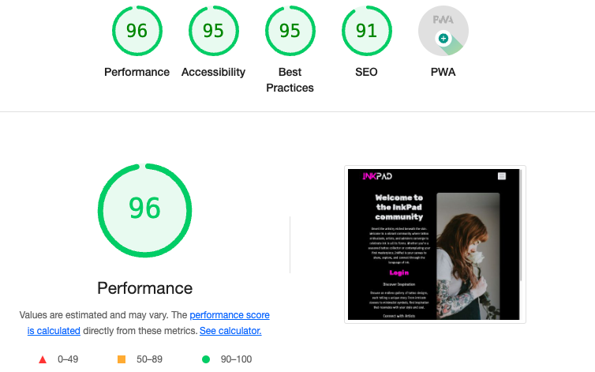
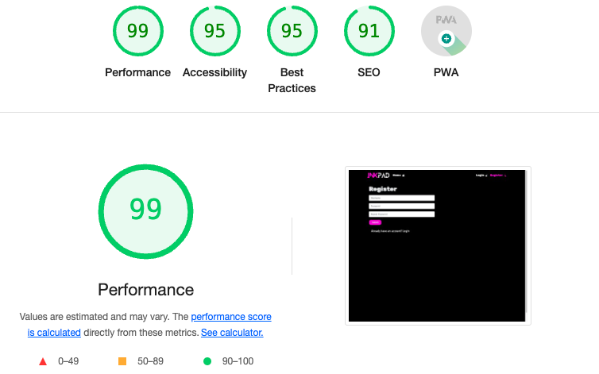
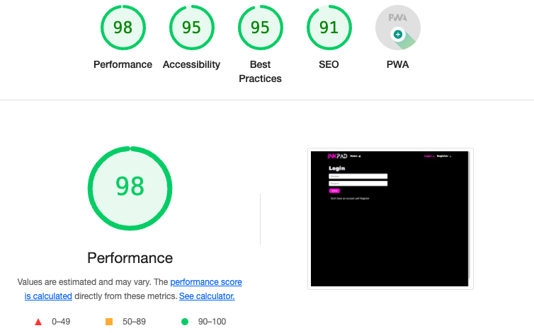
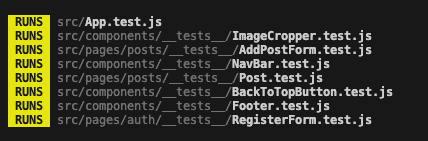
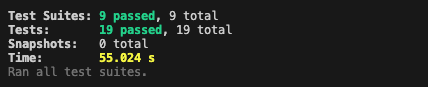

# InkPad

## TESTING FILE

[Visit the live website here](https://pp5-kl-c6a010106309.herokuapp.com/)

 

## Contents

### [Testing](#testing-1)

- [Function Testing](#function-testing)
- [User Story Testing](#user-story-testing)
- [Lighthouse](#lighthouse)
- [Validator Testing](#validator-testing)
- [Unit Testing](#unit-testing)
- [Bugs](#bugs)

 

---

 

## Testing

Testing was performed across a range of devices, including:

- MacBook Air M1
- Nothing Phone (1)
- iPhone 15 Plus

### **Function Testing**

| Page                      | Test                                                                     | Successfully Completed |
| :------------------------ | :----------------------------------------------------------------------- | :--------------------: |
| All                       | Logo text links back to homepage                                         |          Yes           |
| All                       | Navigation links go to relevant page                                     |          Yes           |
| All                       | Social media icons in footer link to external sites, opening in new tabs |          Yes           |
| All                       | Call to action buttons link to relevant page                             |          Yes           |
| All                       | Images and text flex responsively                                        |          Yes           |
| Login & Register          | Form submits                                                             |          Yes           |
| Login                     | Registered user can login successfully                                   |          Yes           |
| Logout                    | Registered user can logout                                               |          Yes           |
| Add post                  | Registered user can upload a new post                                    |          Yes           |
| Add post                  | Users can zoom to crop their images before uploading                     |          Yes           |
| Post                      | Registered user can edit and delete their own posts                      |          Yes           |
| Post                      | Registered user can add a comment to a post                              |          Yes           |
| Post                      | Registered user can edit and delete their own comment                    |          Yes           |
| Profile                   | Registered user can view and update their own Profile                    |          Yes           |
| Profile                   | Users can view other users' profiles                                     |          Yes           |
| All registered user pages | Registered user can follow and unfollow other users                      |          Yes           |
| Post List                 | Users can keyword search posts                                           |          Yes           |

 

### **User Story Testing**

| User Goal                                                                                      | Solution                                                                                                                                               | Successfully Implemented? |
| :--------------------------------------------------------------------------------------------- | :----------------------------------------------------------------------------------------------------------------------------------------------------- | :------------------------ |
| As a user I can navigate the website easily so I can find the pages I want                     | Navigation bar and sidebar menu implemented                                                                                                            | Yes                       |
| As a user I can create a profile so I can interact in the community of registered users        | Able to view, comment on, and like posts. Can follow/unfollow other users                                                                              | Yes                       |
| As a registered user I can login to view my own profile                                        | Login authorisation and profile pages implmented                                                                                                       | Yes                       |
| As a user I can edit my profile and profile image so I can keep my profile updated             | Update profile functionality implemented                                                                                                               | Yes                       |
| As a user I can post images to share my designs with the community                             | Registered users can upload posts via the Add Post Form                                                                                                | Yes                       |
| As a user I can view other posts by registered users so I can look for inspiration             | PostList allows users to browse other users posts. Keyword search also available                                                                       | Yes                       |
| As a user I can favourite other users posts so I can easily refer back to them                 | Like button on posts allows users to add posts to their favourites                                                                                     | Yes                       |
| As a user I can follow other users so that I can easily find their new posts                   | Follow button implemented                                                                                                                              | Yes                       |
| As a user I can see which followers are following me so that I can reciprocate following       | A link to see all posts by users following the logged in user is available via the sidebar menu                                                        | Yes                       |
| As a user I can filter posts by their tags so I can look for specific types of images          | Users are able to search for posts by using the tag in the search bar. Users can also click on the tag of a post to load all search results that match | Yes                       |
| As a user I can filter posts by their user so I can see all the posts by one specific user     | Did not implement as intended, however users can use the keyword search bar to search for users                                                        | Yes                       |
| As a user I can search posts with keywords so I can look for specific types of images          | Keyword search bar implemented                                                                                                                         | Yes                       |
| As a user I can see the most like images so I can keep up to date with what’s trending         | Link to trending posts is available in sidebar menu                                                                                                    | Yes                       |
| As a user I can scroll the posts feed so that I don’t have to click a next button              | Infinite scroll implemented                                                                                                                            | Yes                       |
| As a user I can post comments on other users posts so I can share my thoughts                  | Comment form is available on post page                                                                                                                 | Yes                       |
| As a user I can view other users comments on my posts and other users posts                    | Comments are available to view on post page                                                                                                            | Yes                       |
| As a user I can edit my own posts so I can correct any errors                                  | Edit post functionality is available to the post owner on post page                                                                                    | Yes                       |
| As a user I can delete my own posts so I can remove any unwanted posts                         | Delete post functionality is availble to the post owner on the post page                                                                               | Yes                       |
| As a user I can edit my own comments so I can correct any errors                               | Edit comment functionality is available to the comment owner on the post page                                                                          | Yes                       |
| As a user I can delete my own comments so I can remove any no longer wanted comments I’ve made | Delete comment functionality is available to the comment owner on the post page                                                                        | Yes                       |
| As a user I can view other users’ profiles so I can see their full posts and follow them       | Profile page for each registered user is automatically created                                                                                         | Yes                       |
| As a user I can see the most followed profiles so I can see who is trending                    | The Hottest Profiles section provides users with the top 4-5 user profiles                                                                             | Yes                       |

 

### **Lighthouse**

Home Page

Register

Login

Logged in Home page (PostList Feed)

Profile

Update Profile

Add Post

Post

Trending

Favourites

Following

Followers

 

### **Validator Testing**

#### HTML

All pages passed [WC3](https://validator.w3.org/) validation testing.

Home Page

Register

Login

Logged in Home page (PostList Feed)

Profile

Update Profile

Add Post

Post

Trending

Favourites

Following

Followers

 

#### CSS

Stylesheets passed [WC3](https://jigsaw.w3.org/css-validator/) validation testing

App Stylesheet

AddEditCommentForm Stylesheet

AddPostForm Stylesheet

Asset Stylesheet

Avatar Stylesheet

Buttons Stylesheet

DividerLine Stylesheet

Footer Stylesheet

LoginRegisterForms Stylesheet

MenuDropDown Stylesheet

NavBar Stylesheet

Post Stylesheet

PostList Stylesheet

PostPage Stylesheet

Profile Stylesheet

ProfilePage Stylesheet

SideBarHottestProfiles Stylesheet

 

### JSHint

 

### **Unit Testing**

Unit testing has been carried out across the core elements of the application. Once a test had been written I would fix any errors that arose before moving on.

Whilst the automated testing in this project is not extensive I recognise the importance of it and intend to deepen my knowledge in this area for future projects.

Testing was carried out on the following:

- NavBar
- Footer
- ImageCropper
- BackToTopButton
- LoginForm
- RegisterForm
- AddPostForm
- Post

 

### **Bugs**

Additional testing was carried out by friends and family, and resulting bugs and their solutions were detailed below.

| Raised by   | Bug | Solution |
| :---------- | :-- | :------- |
| User Tester |     |          |
| User Tester |     |          |
| User Tester |     |          |
| User Tester |     |          |

 

---
